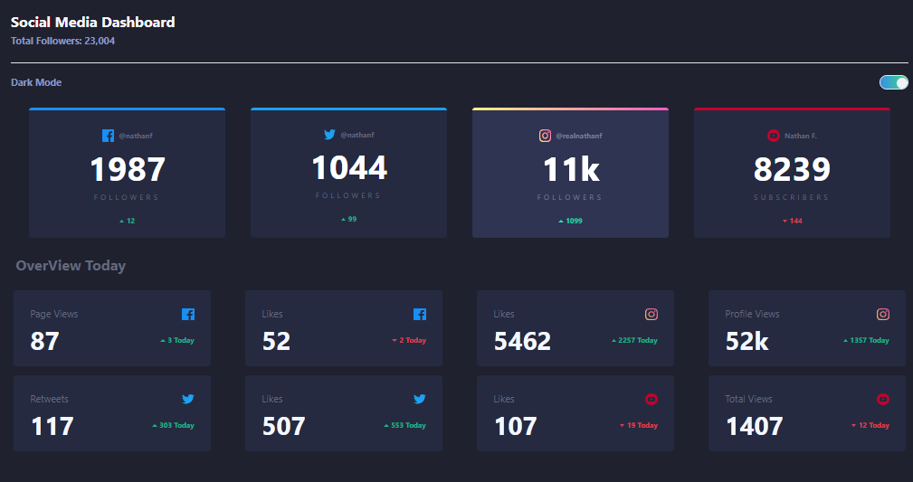
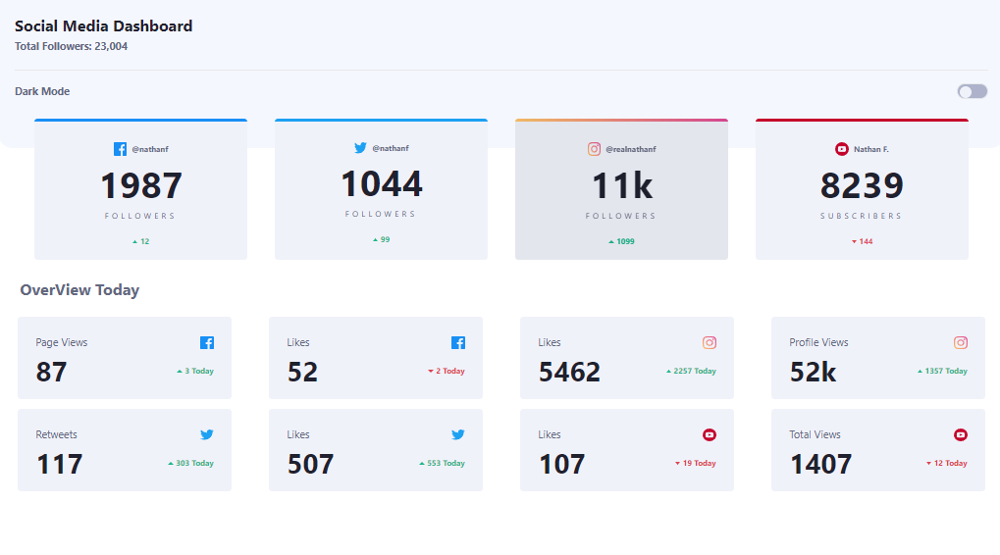

 ## Desafío de Diseño Web con Tailwind CSS y Modo Oscuro 🛜👨‍💻

### Descripción

El desafío consistió en crear una página web utilizando Tailwind CSS como la principal herramienta de estilizado. El objetivo principal fue familiarizarse con los diferentes componentes y funcionalidades que ofrece Tailwind CSS, así como implementar un modo oscuro para mejorar la experiencia del usuario el desafio lo obtuve de https://www.frontendmentor.io/challenges .

### Detalles del Desafío
- **Página de Inicio:** La página de inicio muestra una lista de redes sociales de seguidores en las distintas redes, tanto si se agregan seguidores o bajan los seguidores.
- **Responsividad:** Se aseguró de que la página fuera totalmente responsive, adaptándose a diferentes tamaños de pantalla.

### Funcionalidad Implementada
**Modo Oscuro:** Se incluyó un botón de alternancia para cambiar entre el modo claro y oscuro, con estilos personalizados para la  pagina principal.

 - 

### Instalación

1. Clona este repositorio: `git clone https://github.com/CosmeNicolas/challenge-dashboard-socilaMedia-Tailwind.git`
2. Instala las dependencias: `npm install`
3. Inicia el servidor de desarrollo: `npm run dev`

### Link - Deploy 

[ProyectoTerminado](https://challenge-dashboard-socila-media-tailwind.vercel.app/)